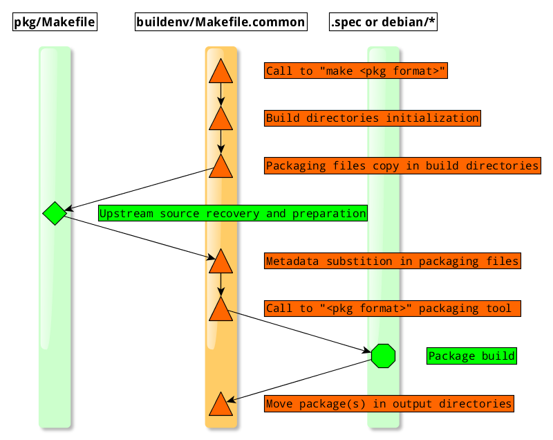

Create a package
----------------

Creating a package *foo* involves the following steps:

* Initialize the packaging directories.
* Fill **foo**/pkg/Makefile (used for common metadata and upstream source recovery and preparation).
* Do the distribution specific stuff (dependencies in *debian/control* and *foo.spec*, pre/post install scripts, init scripts, etc)

Initialize packaging directories
================================

To create the package skeleton:

.. sourcecode:: bash

    $ ./common/init_pkg.sh -n foo

This script will create the following tree:

.. sourcecode:: none

    foo
    ├── buildenv -> ../../common/buildenv
    ├── debian
    │   ├── changelog
    │   ├── compat
    │   ├── conffiles
    │   ├── control
    │   ├── copyright
    │   ├── foo.cron.d.ex
    │   ├── foo.default.ex
    │   ├── init.d.ex
    │   ├── postinst.ex
    │   ├── postrm.ex
    │   ├── preinst.ex
    │   ├── prerm.ex
    │   ├── rules
    │   └── source
    │       └── format
    ├── rpm
    │   └── component.spec
    ├── Makefile
    └── MANIFEST

This tree contains two main directories, two main files, and a symlink:

* **debian**: deb packaging stuff 
* **rpm**: rpm packaging stuff (*component.spec and optionally additionnal content like .service*)
* **Makefile**: (used to download and prepare upstream sources)
* **MANIFEST**: (listing the downloaded files and their hash)
* **buildenv**: symlink to the shared build resources (Makefile.common, and various scripts) 

.. note:: don't rename component.spec, build script for rpm expect this file to exist.

.. note:: additionnal content in rpm/ directory are put in the SOURCES directory of rpmbuild, which means this additional
   files can be added as additional source in component.spec (Source[0-9]+: param and %{SOURCE[0-9]+} macro).
   A typical usage for this in the .service file and associated files like sysconfig file or tmpfile.d file.

Package metadata
================

The package metadata (version, name, description, etc) are declared at the top of the package Makefile:

.. sourcecode:: make

    # Version
    # if possible, keep the upstream version
    VERSION=0.0.1
    
    # Revision number
    # increment it when fixing packaging for a given release
    # reset it to one if version bump
    RELEASE=1
    
    # URL of the upstream project
    URL=http://example.org/stuff
    
    # short summary of what the package provides
    SUMMARY=My package summary
    
    # long version of the summary, (but I could be lazy)
    DESCRIPTION=$(SUMMARY)

.. note::

    During the package build, these variables are automatically substitute in packaging files. 

    This is done by simple running sed -s 's|@VAR@|$(VAR)|' on these files.

    Don't remove the @VAR@ (ex: @SUMMARY@ or @URL@) in the packaging files.

Download upstream sources
=========================

This packaging infrastructure comes with a small tool (*./common/buildenv/wget_sum.sh*) to handle downloads.

This tool role is:

* Download upstream sources.
* Check the integrity of the upstream source against the *MANIFEST* file (sha512 sum).
* Build the *MANIFEST* file if requested
* Handling a local download cache to avoid downloading sources at each build

Download tool usage
~~~~~~~~~~~~~~~~~~~

Inside the Makefile, use it as followed:

.. sourcecode:: make

    $(WGS) -u <url> -o $(BUILD_DIR)/<output file>

Example:

.. sourcecode:: make

    # Name of the package
    NAME = libemf2svg
    
    # Version
    VERSION = 1.0.1
    
    # Revision number 
    RELEASE = 1
    
    # URL of the project 
    URL=https://github.com/kakwa/libemf2svg
    
    # short summary of what the package provides
    SUMMARY="EMF to SVG conversion library"
    
    # long version of the summary, but I'm lazy
    DESCRIPTION=$(SUMMARY)
    
    # example of source recovery url
    URL_SRC=$(URL)/archive/$(VERSION).tar.gz
    
    # Including common rules and targets 
    include buildenv/Makefile.common
    
    $(SOURCE_ARCHIVE): $(SOURCE_DIR) $(CACHE) Makefile MANIFEST
            $(WGS) -u $(URL_SRC) -o $(SOURCE_ARCHIVE)

Building the MANIFEST file
~~~~~~~~~~~~~~~~~~~~~~~~~~

To create the MANIFEST file, just run the following command:

.. sourcecode:: bash

    make manifest

Source preparation
~~~~~~~~~~~~~~~~~~

The source preparation is made in the **$(SOURCE_ARCHIVE)** target.

The goal of this rule is to create the **tar.gz** archive **$(SOURCE_ARCHIVE)**.

The root directory of the source archive should be **$(NAME)-$(VERSION)**, for example:

.. sourcecode:: bash

    tar -tvf cache/mk-sh-skel_1.0.0.orig.tar.gz 
    drwxrwxr-x root/root         0 2015-11-27 00:26 mk-sh-skel-1.0.0/
    -rw-rw-r-- root/root      1135 2015-11-27 00:26 mk-sh-skel-1.0.0/LICENSE
    -rw-rw-r-- root/root       145 2015-11-27 00:26 mk-sh-skel-1.0.0/Makefile
    -rw-rw-r-- root/root       972 2015-11-27 00:26 mk-sh-skel-1.0.0/README.md
    -rw-rw-r-- root/root      1037 2015-11-27 00:26 mk-sh-skel-1.0.0/mksh-skel

In ideal cases, it's only a matter of downloading the upstream sources as these conventions are quite standards.
For example:

.. sourcecode:: make

    # Version
    VERSION = 1.0.1
    
    # URL of the project 
    URL=https://github.com/kakwa/mk-sh-skel
    
    # example of source recovery url
    URL_SRC=$(URL)/archive/$(VERSION).tar.gz
    
    # Basic source archive recovery,
    # this works fine if upstream is clean
    $(SOURCE_ARCHIVE): $(SOURCE_DIR) $(CACHE) Makefile MANIFEST
            $(WGS) -u $(URL_SRC) -o $(SOURCE_ARCHIVE)

But in some cases, it might be necessary to modify the upstream sources content.

For that two helper variables are provided:

* **$(SOURCE_DIR)**: source directory (with proper naming convention) where to put sources
* **$(SOURCE_TAR_CMD)**: once **$(SOURCE_DIR)** is filled with content, just call this variable, it will generate the *$(SOURCE_ARCHIVE)* tar.gz

For example:

.. sourcecode:: make

    # Version
    VERSION = 1.0.7
    
    # URL of the project 
    URL=http://repos.entrouvert.org/python-rfc3161.git
    
    # example of source recovery url
    URL_SRC=$(URL)/snapshot/python-rfc3161-$(VERSION).tar.gz
    
    # preparation of the sources with removal of upstream, unwanted debian/ packaging
    # it does the following:
    # * recover upstream archive
    # * uncompress it
    # * remove the unwanted debian/ dir from upstream source
    # * move remaining stuff to $(SOURCE_DIR)
    # * do some cleanup
    # * build the archive
    $(SOURCE_ARCHIVE): $(SOURCE_DIR) $(CACHE) Makefile MANIFEST
            $(WGS) -u $(URL_SRC) -o $(BUILD_DIR)/python-rfc3161-$(VERSION).tar.gz
            mkdir -p $(BUILD_DIR)/tmp
            tar -vxf $(BUILD_DIR)/$(NAME)-$(VERSION).tar.gz -C $(BUILD_DIR)/tmp
            rm -rf $(BUILD_DIR)/tmp/python-rfc3161-$(VERSION)/debian
            mv $(BUILD_DIR)/tmp/python-rfc3161-$(VERSION)/* $(SOURCE_DIR)
            rm -rf $(BUILD_DIR)/tmp
            rm -f $(BUILD_DIR)/python-rfc3161-$(VERSION).tar.gz
            $(SOURCE_TAR_CMD)

.. warning::

    The preparation steps must not modify, delete or add files outside **$(BUILD_DIR)**, everything must be done inside
    this directory.

Distribution specific packaging
===============================

Nothing special here, just package according to deb/rpm documentation.

General packaging workflow
==========================

Here is the general packaging workflow:

* The steps in orange are common for all packages and must not be modified.
* The steps in green are package specific, it's those steps which must be customized for each package.
